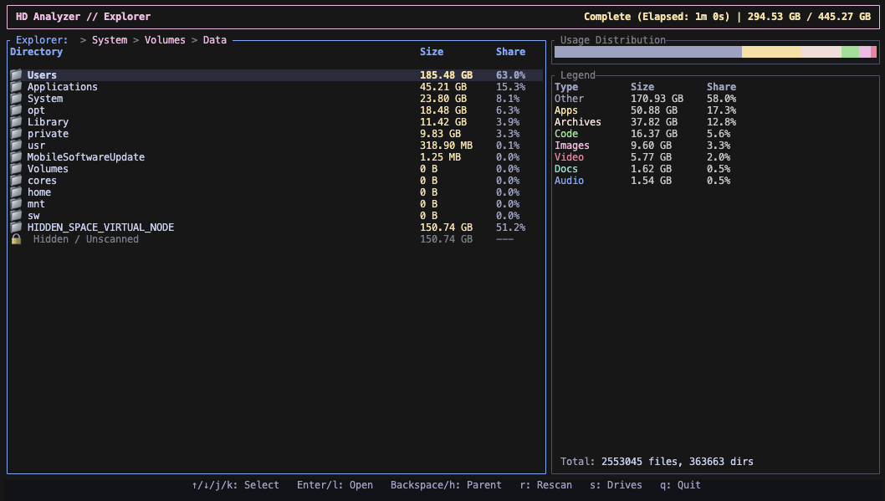

# HD Analyzer 🚀

A high-performance, real-time disk usage analyzer for the terminal, built with Rust and Ratatui.



## Overview

HD Analyzer is designed to give you a deep, instantaneous look into your storage. Unlike traditional `du` commands, it leverages Rust's concurrency model to scan your drive in parallel, providing a responsive, hierarchical explorer that updates in real-time.

## Key Features

- **⚡ Parallel Scanning**: Uses `rayon` to traverse your filesystem using all available CPU cores.
- **🎨 Vibrant UI**: Modern TUI with a TrueColor palette based on the Catppuccin Mocha theme.
- **🔍 Real-time Exploration**: Navigate through directories while the scan is still in progress.
- **🔒 Hidden Space Analysis**: Automatically identifies and tracks "Hidden/Unscanned" space caused by system permissions.
- **🚫 Error Debugging**: Integrated "Access Denied" log to see exactly which paths were skipped and why.
- **📂 Smart Navigation**: Respects filesystem boundaries (won't accidentally wander into mounted network drives).
- **📊 Usage Distribution**: Visual breakdown of space by file categories (Apps, Media, Code, etc.).

## Installation

### Prerequisites
- [Rust](https://www.rust-lang.org/tools/install) (latest stable version)

### Build from source
```bash
git clone https://github.com/vanrez-nez/hd-analyzer.git
cd hd-analyzer
cargo build --release
```

## Usage

Run the analyzer:
```bash
./target/release/hd-analyzer
```

For full access to system folders (to minimize "Hidden Space"):
```bash
sudo ./target/release/hd-analyzer
```

### Keybindings
- `↑ / ↓` or `j / k`: Navigate list
- `Enter` or `l`: Open directory / View errors
- `Backspace` or `h`: Go to parent directory
- `r`: Rescan selected folder
- `s`: Back to drive selection
- `q` or `Esc`: Quit

## Built With
- [Rust](https://www.rust-lang.org/)
- [Ratatui](https://ratatui.rs/)
- [Rayon](https://github.com/rayon-rs/rayon)
